# Build Real-Time Streaming Demo Web App (Javascript/HTML) with Amazon IVS

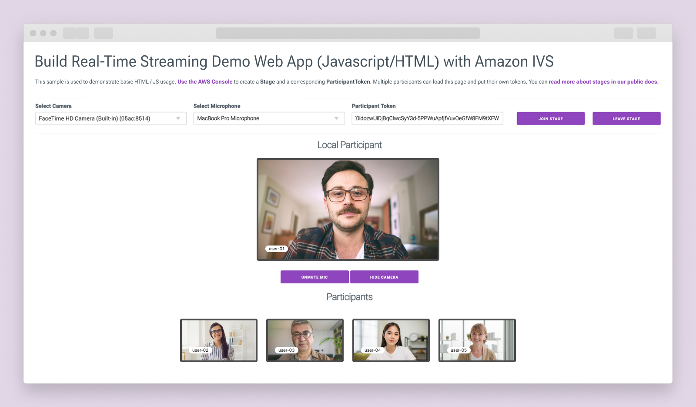

## Project Description

Follow this guide to create a Javascript/HTML demo web application with sub-300ms latency using [Amazon IVS Web Broadcasting SDK](https://docs.aws.amazon.com/ivs/latest/RealTimeUserGuide/broadcast.html). You will get hands-on experience with real-time streaming core concepts and the SDK to broadcast your camera and microphone and view multiple participant streams in real-time.

You will use:

- ExpressJS as the framework as you will eventually need a backend for future advanced sections (https://expressjs.com/)
- Milligram CSS for basic CSS styling (https://milligram.io/)
- Nodemon will automatically restart your Node.js application when it detects file changes. (https://nodemon.io/)

## You will learn how to:

- [Set up development environment](#set-up-the-development-environment)
- [Get started](#get-started)
  - [1. Launch the application server](#1-launch-the-application-server)
  - [2. Create a stage from the AWS console](#2-create-a-stage-from-the-aws-console)
  - [3. Initialize and integrate with the web broadcast SDK](#3-initialize-and-integrate-with-the-web-broadcast-sdk)
  - [4. Configure device permissions for media control](#4-configure-device-permissions-for-media-control)
  - [5. Set up and initialize the stage](#5-set-up-and-initialize-the-stage)
  - [6. Handle joining the stage and controlling the stream](#6-handle-joining-the-stage-and-controlling-the-stream)
  - [7. Manage the departure of participants from the stage](#7-manage-the-departure-of-participants-from-the-stage)
  - [8. Generate tokens for participants and facilitate them joining a stage](#8-generate-tokens-for-participants-and-facilitate-them-joining-a-stage)
  - [9. Add multiple participants to a stage](#9-add-multiple-participants-to-a-stage)
- [Advanced features](#advanced-features)
  - [Create a dynamic grid layout for multiple participants on a stage](#create-a-dynamic-grid-layout-for-multiple-participants-on-a-stage)
  - [Next steps](#next-steps)

## Set up development environment

### 1. Prerequisites

- a. To check for `Node.js`, `npm` and `yarn` installation, open your terminal and execute `node -v`, `npm -v` and `yarn -v` commands.

\*Note: If not installed, refer to the official Node.js and npm installation guide at https://docs.npmjs.com/downloading-and-installing-node-js-and-npm, and the Yarn installation guide at https://classic.yarnpkg.com/lang/en/docs/install/#mac-stable.

### 2. Configure Server and File Structure

- a. Open up your terminal and create a directory, call it `mkdir hello-world` then navigate into that directory `cd hello-world`.

- b. Create another directory called client, `mkdir client` then navigate into that directory `cd client`.

- c. Create a `package.json` file in the `client` directory using the command `npm init -y`. This file serves as a manifest for defining JavaScript project properties.

- d. Navigate to your `client` directory and update the `package.json` file dependencies by running the following commands:

  ```
    yarn add nodemon
    yarn add express
  ```

  This will install [`Nodemon`](https://nodemon.io/), a tool that automatically restarts your Node.js application when it detects file changes, and [`Express`](https://expressjs.com/), a fast and minimal web framework for Node.js that simplifies the development of web applications.

  **`client/package.json`**

  ```client/package.json
    {
      "name": "server",
      "version": "1.0.0",
      "main": "index.js",
      "license": "MIT",
      "scripts": {
        "start": "nodemon index.js"
      },
      "dependencies": {
        "express": "^4.18.2",
        "nodemon": "^3.0.1"
      }
    }
  ```

- e. Within the `client` directory, create an `index.js` file to set up a simple web server using `Express`.

  **`client/index.js`**

  ```client/index.js

    const express = require("express");
    const app = express(); // create express app

    // add middleware
    app.use(express.static("public"));

    // start express server on port 3000
    app.listen(3000, () => {
      console.log("server started on port 3000");
    });

  ```

- f. Use your terminal or editor (e.g., VSCode) to create this file structure:

  ```
  hello-world
  │
  └───client
  │   │   index.js
  │   │   package.json
  │   │   yarn.lock
  │   │
  │   └───public
  │       │   index.html
  │       └───css
  │           └───index.css
  │       └───js
              └───helpers.js
              └───media-devices.js
              └───stages-simple.js

  ```

## Get started

### 1. Launch the application server

- a. Navigate to the `client` folder and execute the following commands:

  - To install all necessary dependencies run, `yarn install`
  - To initiate the application, `yarn start`

- b. In the browser, navigate to `http://localhost:3000/` to see your application.

### 2. Create a stage from the AWS console

- a. In your Amazon console, navigate to Amazon IVS > Real-time streaming > Stages, then at the top right hand corner click ["Create stage"](https://docs.aws.amazon.com/ivs/latest/RealTimeUserGuide/getting-started-create-stage.html)

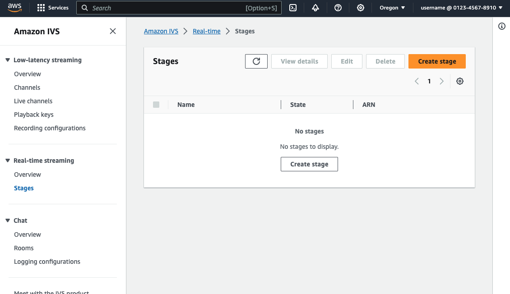

- b. Under "Setup" enter a stage name (this is optional) and any tags associated with the resource. Then, Click on "Create stage" at the bottom right hand corner of the page.

\*Note: A [tag](https://docs.aws.amazon.com/tag-editor/latest/userguide/tagging.html) is a label that you assign to an AWS resource. Each tag consists of a key and an optional value. You can use tags to search and filter your resources or track your AWS costs.

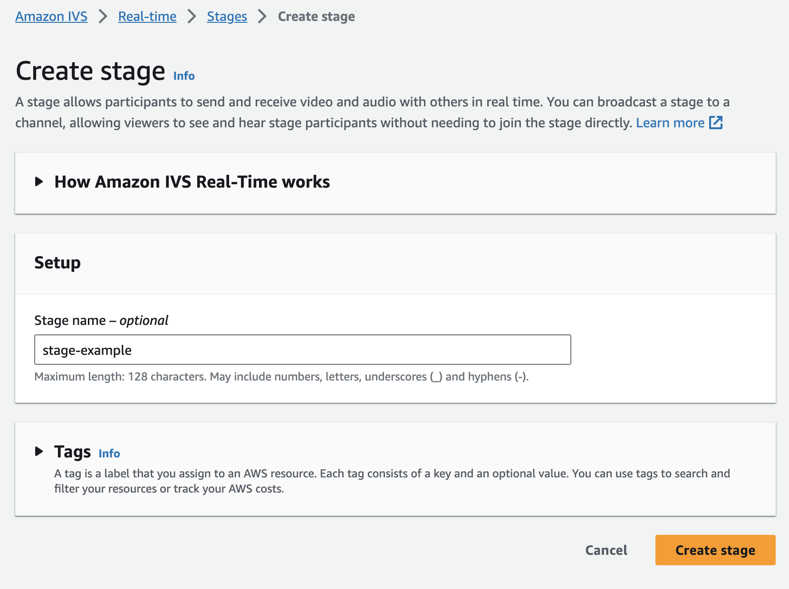

### 3. Initialize and integrate with the web broadcast SDK

The Web broadcast SDK is distributed as a JavaScript library and can be retrieved through https://web-broadcast.live-video.net/1.6.0/amazon-ivs-web-broadcast.js. This is where you are integrating with IVS broadcast SDK for real-time streaming.

- a. Inside the `index.html` file ensure that the [`IVSBroadcastClient`](https://docs.aws.amazon.com/ivs/latest/RealTimeUserGuide/broadcast.html) (https://web-broadcast.live-video.net/1.6.0/amazon-ivs-web-broadcast.js) SDK script is added to your head tag.

  ```client/public/index.html
      <!-- Stages in Broadcast SDK -->
    <script src="https://web-broadcast.live-video.net/1.6.0/amazon-ivs-web-broadcast.js"></script>
  ```

- b. Add the following line to your HTML file's `<head>` section:

  ```client/public/index.html
  <link rel="stylesheet" href="https://cdnjs.cloudflare.com/ajax/libs/milligram/1.4.1/milligram.css" />
  ```

  - By importing the [Milligram CSS framework](https://milligram.io/) from the CDN, you can leverage its minimalist styling for your web project. Milligram offers a range of predefined classes such as `container`, `h1`, `p`, and `button` that you can directly use in your HTML elements to apply its clean and minimalistic design to your web content.

> [!IMPORTANT]
> This is the current structure of your `index.html` file:

**`client/public/index.html`**

```client/public/index.html
  <!DOCTYPE html>
  <html lang="en">
    <head>
      <meta charset="UTF-8" />
      <meta http-equiv="X-UA-Compatible" content="IE=edge" />
      <meta name="viewport" content="width=device-width, initial-scale=1.0" />

      <title>Amazon IVS Real-Time Streaming Web Sample (HTML and JavaScript)</title>

      <!-- Fonts and Styling -->
      <link rel="stylesheet" href="https://fonts.googleapis.com/css?family=Roboto:300,300italic,700,700italic" />
      <link rel="stylesheet" href="https://cdnjs.cloudflare.com/ajax/libs/normalize/8.0.1/normalize.css" />

      <!-- This line imports the Milligram CSS framework from the CDN, allowing you to leverage its minimalist styling for your web project./ -->
      <link rel="stylesheet" href="https://cdnjs.cloudflare.com/ajax/libs/milligram/1.4.1/milligram.css" />
      <link rel="stylesheet" href="./css/index.css" />

      <!-- Stages in Broadcast SDK -->
      <script src="https://web-broadcast.live-video.net/1.6.0/amazon-ivs-web-broadcast.js"></script>
    </head>
    <body></body>
  </html>
```

- c. Add the setup controls for your stage within the body of your `index.html` file.

  **`client/public/index.html`**

  ```client/public/index.html

    ...

    <body>
      <!-- Setup Controls -->
      <div class="row">
        <div class="column">
          <label for="video-devices">Select Camera</label>
          <select disabled id="video-devices">
            <option selected disabled>Choose Option</option>
          </select>
        </div>
        <div class="column">
          <label for="audio-devices">Select Microphone</label>
          <select disabled id="audio-devices">
            <option selected disabled>Choose Option</option>
          </select>
        </div>
        <div class="column">
          <label for="token">Participant Token</label>
          <input type="text" id="token" name="token" />
        </div>
        <div class="column button-container">
          <button class="button" id="join-button">Join Stage</button>
        </div>
        <div class="column button-container">
          <button class="button" id="leave-button">Leave Stage</button>
        </div>
      </div>

      <hr />
    </body>
  ```

- d. Next, create a local participant section in the `index.html` file that will hold your local video, mic control and camera controls.

  **`client/public/index.html`**

  ```client/public/index.html

    ...

    <!-- Local Participant -->
    <div class="row local-container">

      <div class="column" id="local-media">
        <h3 id="local-participant-header" class="hidden">Local Participant</h3>
      </div>
      <div class="static-controls hidden" id="local-controls">
        <button class="button" id="mic-control">Mute Mic</button>
        <button class="button" id="camera-control">Hide Camera</button>
      </div>
    </div>

    <hr class="margin-top"/>
  ```

- e. Create a remote participants section after the local participant section.

  **`client/public/index.html`**

  ```client/public/index.html

    ...

    <!-- Remote Participants -->

    <h3 id="remote-participants-header" class="hidden">Participants</h3>
    <div class="row">
      <div id="remote-media"></div>
    </div>
  ```

- f. Finally, load all the necessary scripts for the application. In this example, you will utilize three scripts to facilitate the application's development.

  **`client/public/index.html`**

  ```client/public/index.html
    <!-- Load all Desired Scripts -->
    <script src="./js/helpers.js"></script>
    <script src="./js/media-devices.js"></script>
    <script src="./js/stages-simple.js"></script>
  ```

> [!IMPORTANT]
> Your `index.html` should look like this when completed:

**`client/public/index.html`**

```client/public/index.html

  <!DOCTYPE html>
  <html lang="en">

  <head>
    <meta charset="UTF-8" />
    <meta http-equiv="X-UA-Compatible" content="IE=edge" />
    <meta name="viewport" content="width=device-width, initial-scale=1.0" />

    <title>Amazon IVS Real-Time Streaming Web Sample (HTML and JavaScript)</title>

    <!-- Fonts and Styling -->
    <link rel="stylesheet" href="https://fonts.googleapis.com/css?family=Roboto:300,300italic,700,700italic" />
    <link rel="stylesheet" href="https://cdnjs.cloudflare.com/ajax/libs/normalize/8.0.1/normalize.css" />

    <!-- This line imports the Milligram CSS framework from the CDN, allowing you to leverage its minimalist styling for your web project./ -->
    <link rel="stylesheet" href="https://cdnjs.cloudflare.com/ajax/libs/milligram/1.4.1/milligram.css" />
    <link rel="stylesheet" href="./css/index.css" />

    <!-- Stages in Broadcast SDK -->
    <script src="https://web-broadcast.live-video.net/1.6.0/amazon-ivs-web-broadcast.js"></script>
  </head>

  <body>
    <!-- Introduction -->
    <header>
      <h1>Amazon IVS Real-Time Streaming Web Sample (HTML and JavaScript)</h1>

      <p>This sample is used to demonstrate basic HTML / JS usage. <b><a href="https://docs.aws.amazon.com/ivs/latest/userguide/multiple-hosts.html">Use the AWS CLI</a></b> to create a <b>Stage</b> and a corresponding <b>ParticipantToken</b>. Multiple participants can load this page and put in their own tokens. You can <b><a href="https://aws.github.io/amazon-ivs-web-broadcast/docs/sdk-guides/stages#glossary" target="_blank">read more about stages in our public docs.</a></b></p>
    </header>
    <hr />

    <!-- Setup Controls -->
    <div class="row">
      <div class="column">
        <label for="video-devices">Select Camera</label>
        <select disabled id="video-devices">
          <option selected disabled>Choose Option</option>
        </select>
      </div>
      <div class="column">
        <label for="audio-devices">Select Microphone</label>
        <select disabled id="audio-devices">
          <option selected disabled>Choose Option</option>
        </select>
      </div>
      <div class="column">
        <label for="token">Participant Token</label>
        <input type="text" id="token" name="token" />
      </div>
      <div class="column button-container">
        <button class="button" id="join-button">Join Stage</button>
      </div>
      <div class="column button-container">
        <button class="button" id="leave-button">Leave Stage</button>
      </div>
    </div>

    <hr />

    <!-- Local Participant -->
    <div class="row local-container">

      <div class="column" id="local-media">
        <h3 id="local-participant-header" class="hidden">Local Participant</h3>
      </div>
      <div class="static-controls hidden" id="local-controls">
        <button class="button" id="mic-control">Mute Mic</button>
        <button class="button" id="camera-control">Hide Camera</button>
      </div>
    </div>

    <hr class="margin-top"/>

    <!-- Remote Participants -->

    <h3 id="remote-participants-header" class="hidden">Participants</h3>
    <div class="row">
      <div id="remote-media"></div>
    </div>

    <!-- Load all Desired Scripts -->
    <script src="./js/helpers.js"></script>
    <script src="./js/media-devices.js"></script>
    <script src="./js/stages-simple.js"></script>
  </body>

  </html>
```

- g. Apply basic styling within the `index.css` file, then refresh your browser.

  **`client/public/css/index.css`**

  ```client/public/css/index.css
    html,
    body {
      margin: 2rem;
      box-sizing: border-box;
      height: 100vh;
      max-height: 100vh;
      display: flex;
      flex-direction: column;
    }

    hr {
      margin: 1rem 0;
    }

    table {
      display: table;
    }

    canvas {
      margin-bottom: 1rem;
      background: green;
    }

    video {
      margin-bottom: 1rem;
      background: black;
      max-width: 100%;
      max-height: 150px;
      aspect-ratio: 16 / 9;
    }

    h3 {
      display: flex;
      justify-content: center;
    }

    .log {
      flex: none;
      height: 300px;
    }

    .content {
      flex: 1 0 auto;
    }

    .button {
      display: block;
      margin: 0 auto;
      max-width: 20rem;
      margin-left: 2rem;
      margin: auto;
      width: 100%;
    }

    .margin-top {
      margin-top: 5rem
    }

    .button-container {
      display: flex !important;
      margin-top: 1.5rem;
    }

    .local-container {
      position: relative;
    }

    .static-controls {
      position: absolute;
      margin-left: auto;
      margin-right: auto;
      left: 0;
      right: 0;
      bottom: -4rem;
      text-align: center;
    }

    .static-controls button {
      display: inline-block;
    }

    .hidden {
      display: none;
    }

    .participant-container {
      display: flex;
      align-items: center;
      justify-content: center;
      flex-direction: column;
      margin: 1rem;
    }

    video {
      border: 0.5rem solid #555;
      border-radius: 0.5rem;
      width: 100%;
    }

    .relative {
      position: relative;
    }

    .overlay-pill {
      position: absolute;
      bottom: 40px;
      left: 24px;
      padding: 0px 12px;
      background-color: #fff;
      color: black;
      border-radius: 20px;
      font-size: 14px;
    }

    .placeholder {
      background-color: #333333;
      display: flex;
      text-align: center;
      margin-bottom: 1rem;
    }
    .placeholder span {
      margin: auto;
      color: white;
    }
    #local-media {
      display: inline-block;
      width: 100vw;
    }

    #local-media video {
      max-height: 300px;
    }

    #remote-media {
      display: flex;
      justify-content: center;
      align-items: center;
      flex-direction: row;
      width: 100%;
    }
  ```

**you have successfully deployed your website, but the current code is non-functional. Implementation of the working code will follow in the upcoming section.**

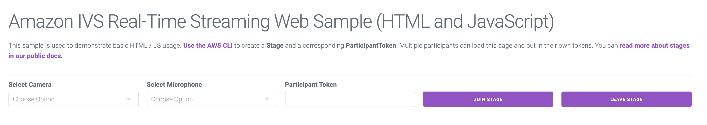

### 4. Configure device permissions for media control

- a. Navigate to the `media-devices.js` file inside of the `client/public/js` folder.

- b. Implement the `getDevices` function to verify the availability of both video and audio devices. Categorize and collect them for subsequent use.

\*Note: Refer to [MDN Web Docs - MediaDevices.getUserMedia](https://developer.mozilla.org/en-US/docs/Web/API/MediaDevices/getUserMedia) for information on the getMedia API.

**`client/public/js/media-devices.js`**

```client/public/js/media-devices.js
    async function getDevices() {
      // Prevents issues on Safari/FF so devices are not blank
      await navigator.mediaDevices.getUserMedia({ video: true, audio: true });

      const devices = await navigator.mediaDevices.enumerateDevices();

      // Get all video devices
      const videoDevices = devices.filter((d) => d.kind === "videoinput");
      if (!videoDevices.length) {
          console.error("No video devices found.");
      }

      // Get all audio devices
      const audioDevices = devices.filter((d) => d.kind === "audioinput");
      if (!audioDevices.length) {
          console.error("No audio devices found.");
      }

      return { videoDevices, audioDevices };
  }
```

- c. Next, create a `initializeDeviceSelect` function that enables and populates the video and audio device select elements on the web page with the available devices obtained from the `getDevices` function.

  **`client/public/js/media-devices.js`**

  ```client/public/js/media-devices.js
    async function initializeDeviceSelect() {

      // It retrieves the HTML elements with the IDs "video-devices" and "audio-devices" and enables them for interaction.
      const videoSelectEl = document.getElementById("video-devices");
      videoSelectEl.disabled = false;

      // Using the getDevices function, it obtains a list of available video and audio devices.
      const { videoDevices, audioDevices } = await getDevices();

      // For each video device, it creates an Option element with the device's label as the text and the device's ID as the value, and adds this Option to the videoSelectEl select element.
      videoDevices.forEach((device, index) => {
          videoSelectEl.options[index] = new Option(device.label, device.deviceId);
      });

      // Similarly, for each audio device, it creates an Option element with the device's label as the text and the device's ID as the value, and adds this Option to the audioSelectEl select element.
      const audioSelectEl = document.getElementById("audio-devices");

      audioSelectEl.disabled = false;
      audioDevices.forEach((device, index) => {
          audioSelectEl.options[index] = new Option(device.label, device.deviceId);
      });
    }
  ```

- d. Lastly, you will create a `getMic` and `getCamera` function that facilitate the retrieval of camera and microphone streams, allowing users to select specific devices if needed.

  **`client/public/js/media-devices.js`**

  ```client/public/js/media-devices.js

    ...

    async function getCamera(deviceId) {
        // Use Max Width and Height
        return navigator.mediaDevices.getUserMedia({
            video: {
            deviceId: deviceId ? { exact: deviceId } : null,
            },
            audio: false,
        });
    }

    async function getMic(deviceId) {
        return navigator.mediaDevices.getUserMedia({
            video: false,
            audio: {
            deviceId: deviceId ? { exact: deviceId } : null,
            },
      });
    }
  ```

### 5. Set up and initialize the stage

- a. Navigate to the `stages-simple.js` file inside of the `client/public/js` folder.

- b. In the `stages-simple.js` file, you need to fetch all the necessary methods from the `IVSBroadcastClient` at the beginning of the file to initiate a stage.

\*Note: For a comprehensive guide on available methods in the SDK, visit the [Amazon IVS Web Broadcast SDK Reference](https://aws.github.io/amazon-ivs-web-broadcast/docs/v1.3.1/sdk-reference).

**`client/public/js/stages-simple.js`**

```client/public/js/stages-simple.js
  const {
      Stage,
      LocalStageStream,
      SubscribeType,
      StageEvents,
      ConnectionState,
      StreamType,
  } = IVSBroadcastClient;
```

- c. Next, you will create the variables referencing specific elements from the current HTML document.

  **`client/public/js/stages-simple.js`**

  ```client/public/js/stages-simple.js

    ...

    let localParticipantHeader = document.getElementById(
      "local-participant-header"
    );
    let remoteParticipantsHeader = document.getElementById(
      "remote-participants-header"
    );

    let cameraButton = document.getElementById("camera-control");
    let micButton = document.getElementById("mic-control");
    let joinButton = document.getElementById("join-button");
    let leaveButton = document.getElementById("leave-button");

    let controls = document.getElementById("local-controls");
    let videoDevicesList = document.getElementById("video-devices");
    let audioDevicesList = document.getElementById("audio-devices");
  ```

- e. Next, you will add variables that will be used for the management and control of the stage and the streams associated with it within the program.

  **`client/public/js/stages-simple.js`**

  ```client/public/js/stages-simple.js
    // Stage management
    let stage;
    let joining = false;
    let connected = false;
    let localCamera;
    let localMic;
    let cameraStageStream;
    let micStageStream;
    let remoteStreams = [];
  ```

- f. Establish a `init` function to initialize application event listeners and functionalities, then invoke the `initializeDeviceSelect` function from your `media-devices.js` file.

  **`client/public/js/stages-simple.js`**

  ```client/public/js/stages-simple.js
  const init = async () => {
      await initializeDeviceSelect();
    }
  ```

- g. Next, create event listeners inside of the `init` function that toggle the hide status of the camera stream when clicked and an event listener that toggles the mute status of the microphone when clicked.

  **`client/public/js/stages-simple.js`**

  ```client/public/js/stages-simple.js

    ...

    // Toggles the mute status of the camera stream when clicked. The button text is updated accordingly to either "Show Camera" or "Hide Camera" depending on the mute status.
    cameraButton.addEventListener("click", () => {
      const isMuted = !cameraStageStream.isMuted;
      cameraStageStream.setMuted(isMuted);
      cameraButton.innerText = isMuted ? "Show Camera" : "Hide Camera";
    });

    // Toggles the mute status of the microphone stream when clicked. The button text is updated accordingly to either "Unmute Mic" or "Mute Mic" depending on the mute status.
    micButton.addEventListener("click", () => {
      const isMuted = !micStageStream.isMuted;
      micStageStream.setMuted(isMuted);
      micButton.innerText = isMuted ? "Unmute Mic" : "Mute Mic";
    });
  ```

> [!IMPORTANT]
> Your `init` function should now look like this:

**`client/public/js/stages-simple.js`**

```client/public/js/stages-simple.js
  const init = async () => {
    // Line ensures that the device selection is initialized before proceeding further.
    await initializeDeviceSelect();

    // Toggles the mute status of the camera stream when clicked. The button text is updated accordingly to either "Show Camera" or "Hide Camera" depending on the mute status.
    cameraButton.addEventListener("click", () => {
      const isMuted = !cameraStageStream.isMuted;
      cameraStageStream.setMuted(isMuted);
      cameraButton.innerText = isMuted ? "Show Camera" : "Hide Camera";
    });

    // Toggles the mute status of the microphone stream when clicked. The button text is updated accordingly to either "Unmute Mic" or "Mute Mic" depending on the mute status.
    micButton.addEventListener("click", () => {
      const isMuted = !micStageStream.isMuted;
      micStageStream.setMuted(isMuted);
      micButton.innerText = isMuted ? "Unmute Mic" : "Mute Mic";
    });
  }
```

### 6. Handle joining the stage and controlling the stream

- a. Create a `joinStage` function inside of your `stages-simple.js` file. This manages the process of joining a stage and controlling the related streaming functionalities. Then add a conditional that checks if the user is already connected or in the process of joining.

  **`client/public/js/stages-simple.js`**

  ```client/public/js/stages-simple.js
    const joinStage = async () => {
      // It checks if the user is already connected or in the process of joining. If so, it stops the execution.
      if (connected || joining) {
          return;
      }
      joining = true;
    }
  ```

- b. Inside the `joinStage` function, define a variable `token` and include an alert if the `token` is missing. This is where you'll input the participant token for stage access. Generating this token will be discussed later.

  **`client/public/js/stages-simple.js`**

  ```client/public/js/stages-simple.js
    const joinStage = async () => {

      ...

      // The function retrieves the token entered in the HTML document. If no token is provided, it alerts the user to enter a participant token and stops the execution.
      const token = document.getElementById("token").value;
      if (!token) {
          window.alert("Please enter a participant token");
          joining = false;
          return;
      }
    }
  ```

- c. Retrieve the local camera and microphone media based on the selected devices using the `getMic` and `getCamera` functions from your `media-devices.js` file.

  **`client/public/js/stages-simple.js`**

  ```client/public/js/stages-simple.js
    const joinStage = async () => {

      ...

      localCamera = await getCamera(videoDevicesList.value);
      localMic = await getMic(audioDevicesList.value);
    }
  ```

- d. After obtaining the `localCamera` and `localMic` devices, create [`LocalStageStream`](https://aws.github.io/amazon-ivs-web-broadcast/docs/v1.3.1/sdk-reference/classes/LocalStageStream) instances for both the camera and microphone.

  **`client/public/js/stages-simple.js`**

  ```client/public/js/stages-simple.js
    const joinStage = async () => {

      ...

      cameraStageStream = new LocalStageStream(localCamera.getVideoTracks()[0]);
      micStageStream = new LocalStageStream(localMic.getAudioTracks()[0]);
    }
  ```

- e. Next, create a [`strategy`](https://aws.github.io/amazon-ivs-web-broadcast/docs/v1.4.0/sdk-guides/stages#strategy) for the stage. This defines which streams to publish and which participants to subscribe to.

  **`client/public/js/stages-simple.js`**

  ```client/public/js/stages-simple.js
    const joinStage = async () => {

    ...

    const strategy = {
        stageStreamsToPublish() {
          return [cameraStageStream, micStageStream];
        },
        shouldPublishParticipant() {
          return true;
        },
        shouldSubscribeToParticipant() {
          return SubscribeType.AUDIO_VIDEO;
        },
      };
    }
  ```

- f. Create a new [stage](https://aws.github.io/amazon-ivs-web-broadcast/docs/v1.4.0/sdk-guides/stages#stage) instance.

  **`client/public/js/stages-simple.js`**

  ```client/public/js/stages-simple.js
    const joinStage = async () => {

      ...

      stage = new Stage(token, strategy);
    }
  ```

> [!IMPORTANT]
> Your `joinStage` function should now appear as follows:

**`client/public/js/stages-simple.js`**

```client/public/js/stages-simple.js
  const joinStage = async () => {
    //It checks if the user is already connected or in the process of joining. If so, it stops the execution.
    if (connected || joining) {
      return;
    }
    joining = true;

    //The function retrieves the token entered in the HTML document. If no token is provided, it alerts the user to enter a participant token and stops the execution.
    const token = document.getElementById("token").value;
    if (!token) {
      window.alert("Please enter a participant token");
      joining = false;
      return;
    }

    // It retrieves the local camera and microphone media based on the selected devices.
    localCamera = await getCamera(videoDevicesList.value);
    localMic = await getMic(audioDevicesList.value);

    // Creates LocalStageStream instances for the camera and microphone.
    cameraStageStream = new LocalStageStream(localCamera.getVideoTracks()[0]);
    micStageStream = new LocalStageStream(localMic.getAudioTracks()[0]);

    // It sets up a strategy for the stage, defining which streams to publish and which participants to subscribe to.
    const strategy = {
      stageStreamsToPublish() {
        return [cameraStageStream, micStageStream];
      },
      shouldPublishParticipant() {
        return true;
      },
      shouldSubscribeToParticipant() {
        return SubscribeType.AUDIO_VIDEO;
      },
    };

    // Creates a new stage instance
    stage = new Stage(token, strategy);
  }
```

- g. Establish [event listeners](https://aws.github.io/amazon-ivs-web-broadcast/docs/v1.4.0/sdk-guides/stages#events) inside of the `joinStage` function for the stage, covering events like connection state changes, participant joining, participant stream additions, and participant leaving.

  - `STAGE_CONNECTION_STATE_CHANGED`: When the connection state changes, you update the joining status and manage the element display through classList. Additionally, you default to muting the stage stream's microphone to prevent potential infinite feedback loops upon user stage entry.

    **`client/public/js/stages-simple.js`**

  ```client/public/js/stages-simple.js

        ...

    stage.on(StageEvents.STAGE_CONNECTION_STATE_CHANGED, (state) => {
      connected = state === ConnectionState.CONNECTED;
      if (connected) {
        joining = false;
        controls.classList.remove("hidden");
        localParticipantHeader.classList.remove("hidden");
        remoteParticipantsHeader.classList.remove("hidden");

        // Mutes the microphone stage stream and updates the inner text of the mic button to "Unmute Mic"
        micStageStream.setMuted(true);
        micButton.innerText = "Unmute Mic";

      } else {
        controls.classList.add("hidden");
        localParticipantHeader.classList.add("hidden");
        remoteParticipantsHeader.classList.add("hidden");
      }
    });
  ```

  - `STAGE_PARTICIPANT_JOINED`: Notifies in the console when a new participant joins the stage.

  ```client/public/js/stages-simple.js

      ...

      stage.on(StageEvents.STAGE_PARTICIPANT_JOINED, (participant) => {
          console.log("Participant Joined:", participant);
      });
  ```

  - `STAGE_PARTICIPANT_STREAMS_ADDED`: When participant streams are added, inform the developer via the console. Exclude local audio streams for the local participant to prevent echo.

  ```client/public/js/stages-simple.js

      ...

      stage.on(
          StageEvents.STAGE_PARTICIPANT_STREAMS_ADDED,
          (participant, streams) => {
          console.log("Participant Media Added: ", participant, streams);

          let streamsToDisplay = streams;

          if (participant.isLocal) {
              streamsToDisplay = streams.filter(
              (stream) => stream.streamType === StreamType.VIDEO
              );
            }
          }
      );
  ```

  - `STAGE_PARTICIPANT_LEFT`: When a participant has left, notify the developer in the console.

  ```client/public/js/stages-simple.js
      stage.on(StageEvents.STAGE_PARTICIPANT_LEFT, (participant) => {
          console.log("Participant Left: ", participant);
        });
      }
  ```

- h. Inside the `helpers.js` file, create `createContainer`, `createVideoEl`, and `createOverlayEl` functions that generate a participant container, a participant video element, and a video overlay element respectively. The overlay should display the username if available on the video.

  **`client/public/js/helpers.js`**

  ```client/public/js/helpers.js

    function createVideoEl(id) {
      const videoEl = document.createElement("video");
      videoEl.id = id;
      videoEl.autoplay = true;
      videoEl.playsInline = true;
      videoEl.srcObject = new MediaStream();
      return videoEl;
    }

    function createOverlayEl(username) {
        const overlayEl = document.createElement("div");
        overlayEl.classList.add("overlay-pill");
        overlayEl.innerText = username ? username : `user-${participants}`;
        return overlayEl;
    }

    function createContainer(id) {
      const participantContainer = document.createElement("div");
      participantContainer.classList = "participant-container";
      participantContainer.id = id + "-container";

      return participantContainer;
    }

  ```

- i. Initialize a participant size at the top of the `helpers.js` file. Then, create a `setupParticipant` function to configure the user interface for a participant in the video:

  - Increments the value of `participants` by 1
  - It determines whether the participant is `local` or `remote`.
  - It determines the appropriate group ID based on whether the participant is local or remote.
  - It retrieves the group container element based on the determined group ID.
  - Create a new div element for the participant's video container and add the 'relative' class
  - It creates a unique container for the participant and appends it to the selected group container.
  - Creates a video element for the participant using the `createVideoEl` function and appends the video element to the participant's container element
  - Appends the video element and overlay element to the participant video container, then appends the participant video container to the main participant container
  - Finally, it returns the video element for further use in the application.

    **`client/public/js/helpers.js`**

  ```client/public/js/helpers.js

    // Initialize a participant size
    let participants = 0;

    function setupParticipant({ isLocal, id, attributes }) {

      // Increments the value of participants by 1
      participants = participants + 1

      // It determines the appropriate group ID based on whether the participant is local or remote.
      const groupId = isLocal ? "local-media" : "remote-media";

      // It retrieves the group container element based on the determined group ID.
      const groupContainer = document.getElementById(groupId);

      // It generates a unique participant container ID based on whether the participant is local or remote and
      // creates a container element for the participant using the createContainer function.
      const participantContainerId = isLocal ? "local" : id;
      const participantContainer = createContainer(participantContainerId);

      // Create a new div element for the participant's video container and add the 'relative' class
      const participantVideoContainer = document.createElement("div");
      participantVideoContainer.classList.add("relative");

      // Creates a video element for the participant using the createVideoEl function and appends the video element to the participant's container element
      const videoEl = createVideoEl(participantContainerId);
      const overlayEl = createOverlayEl(attributes.username);

      // Appends the video element and overlay element to the participant video container,
      // then appends the participant video container to the main participant container
      participantVideoContainer.append(videoEl, overlayEl);
      participantContainer.appendChild(participantVideoContainer);

      groupContainer.appendChild(participantContainer);

      return videoEl;
    }
  ```

> [!IMPORTANT]
> At this point, your `helpers.js` file should resemble this:

**`client/public/js/helpers.js`**

```client/public/js/helpers.js
  let participants = 0;

  function setupParticipant({ isLocal, id, attributes }) {

    participants = participants + 1

    const groupId = isLocal ? "local-media" : "remote-media";

    const groupContainer = document.getElementById(groupId);

    const participantContainerId = isLocal ? "local" : id;
    const participantContainer = createContainer(participantContainerId);

    const participantVideoContainer = document.createElement("div");
    participantVideoContainer.classList.add("relative");

    const videoEl = createVideoEl(participantContainerId);
    const overlayEl = createOverlayEl(attributes.username);

    participantVideoContainer.append(videoEl, overlayEl);
    participantContainer.appendChild(participantVideoContainer);

    groupContainer.appendChild(participantContainer);

    return videoEl;
  }

  function createVideoEl(id) {
    const videoEl = document.createElement("video");
    videoEl.id = id;
    videoEl.autoplay = true;
    videoEl.playsInline = true;
    videoEl.srcObject = new MediaStream();
    return videoEl;
  }

  function createOverlayEl(username) {
      const overlayEl = document.createElement("div");
      overlayEl.classList.add("overlay-pill");
      overlayEl.innerText = username ? username : `user-${participants}`;
      return overlayEl;
  }

  function createContainer(id) {
    const participantContainer = document.createElement("div");
    participantContainer.classList = "participant-container";
    participantContainer.id = id + "-container";

    return participantContainer;
  }
```

- j. Next, inside of the `stages-simple.js` file, integrate the `setupParticipant` function into the `STAGE_PARTICIPANT_STREAMS_ADDED` event and include a forEach loop that adds each media stream track to the participant's video element.

  **`client/public/js/stages-simple.js`**

  ```client/public/js/stages-simple.js
    stage.on(
      StageEvents.STAGE_PARTICIPANT_STREAMS_ADDED,
      (participant, streams) => {

        ...

        const videoEl = setupParticipant(participant);
        streamsToDisplay.forEach((stream) =>
          videoEl.srcObject.addTrack(stream.mediaStreamTrack)
        );
      }
    );
  ```

- k. Create a try-catch block that tries to [join the stage](https://aws.github.io/amazon-ivs-web-broadcast/docs/v1.4.0/sdk-guides/stages#concepts), and if an error occurs during the process, it handles the error and resets the joining and connected flags accordingly.

  **`client/public/js/stages-simple.js`**

  ```client/public/js/stages-simple.js

    ...

    try {
      await stage.join();
    } catch (err) {
      joining = false;
      connected = false;
      console.error(err.message);
    }
  ```

- l. Attach the `joinStage` function to a `joinButton` inside your `init` function, which will trigger the `joinStage` function when clicked, enabling the user to join.

  **`client/public/js/stages-simple.js`**

  ```client/public/js/stages-simple.js

    const init = async () => {

      ...

      // Triggers the leaveStage function when clicked, allowing the user to leave the current stage.
      joinButton.addEventListener("click", () => {
        joinStage();
      });
    };
  ```

- m. Finally, call the `init` function at the end of your `stages-simple.js` file to initialize the audio and video streaming setup.

  **`client/public/js/stages-simple.js`**

  ```client/public/js/stages-simple.js

    ...

    init()

  ```

> [!IMPORTANT]
> At this point, your `stages-simple.js` file should resemble this:

**`client/public/js/stages-simple.js`**

```client/public/js/stages-simple.js

const {
  Stage,
  LocalStageStream,
  SubscribeType,
  StageEvents,
  ConnectionState,
  StreamType,
} = IVSBroadcastClient;

let localParticipantHeader = document.getElementById(
  "local-participant-header"
);
let remoteParticipantsHeader = document.getElementById(
  "remote-participants-header"
);

let cameraButton = document.getElementById("camera-control");
let micButton = document.getElementById("mic-control");
let joinButton = document.getElementById("join-button");
let leaveButton = document.getElementById("leave-button");

let controls = document.getElementById("local-controls");
let videoDevicesList = document.getElementById("video-devices");
let audioDevicesList = document.getElementById("audio-devices");

let stage;
let joining = false;
let connected = false;
let localCamera;
let localMic;
let cameraStageStream;
let micStageStream;
let remoteStreams = [];

const init = async () => {

  await initializeDeviceSelect();

  cameraButton.addEventListener("click", () => {
    const isMuted = !cameraStageStream.isMuted;
    cameraStageStream.setMuted(isMuted);
    cameraButton.innerText = isMuted ? "Show Camera" : "Hide Camera";
  });

  micButton.addEventListener("click", () => {
    const isMuted = !micStageStream.isMuted;
    micStageStream.setMuted(isMuted);
    micButton.innerText = isMuted ? "Unmute Mic" : "Mute Mic";
  });

  joinButton.addEventListener("click", () => {
    joinStage();
  });

};

const joinStage = async () => {

  if (connected || joining) {
    return;
  }
  joining = true;

  const token = document.getElementById("token").value;
  if (!token) {
    window.alert("Please enter a participant token");
    joining = false;
    return;
  }

  localCamera = await getCamera(videoDevicesList.value);
  localMic = await getMic(audioDevicesList.value);

  cameraStageStream = new LocalStageStream(localCamera.getVideoTracks()[0]);
  micStageStream = new LocalStageStream(localMic.getAudioTracks()[0]);

  const strategy = {
    stageStreamsToPublish() {
      return [cameraStageStream, micStageStream];
    },
    shouldPublishParticipant() {
      return true;
    },
    shouldSubscribeToParticipant() {
      return SubscribeType.AUDIO_VIDEO;
    },
  };

  stage = new Stage(token, strategy);

  stage.on(StageEvents.STAGE_CONNECTION_STATE_CHANGED, (state) => {
    connected = state === ConnectionState.CONNECTED;
    if (connected) {
      joining = false;
      controls.classList.remove("hidden");
      localParticipantHeader.classList.remove("hidden");
      remoteParticipantsHeader.classList.remove("hidden");

      micStageStream.setMuted(true);
      micButton.innerText = "Unmute Mic";

    } else {
      controls.classList.add("hidden");
      localParticipantHeader.classList.add("hidden");
      remoteParticipantsHeader.classList.remove("hidden");
    }
  });

  stage.on(StageEvents.STAGE_PARTICIPANT_JOINED, (participant) => {
    console.log("Participant Joined:", participant);
  });

  stage.on(
    StageEvents.STAGE_PARTICIPANT_STREAMS_ADDED,
    (participant, streams) => {
      console.log("Participant Media Added: ", participant, streams);

      let streamsToDisplay = streams;

      if (participant.isLocal) {
        streamsToDisplay = streams.filter(
          (stream) => stream.streamType === StreamType.VIDEO
        );
      }

      const videoEl = setupParticipant(participant);
      streamsToDisplay.forEach((stream) =>
        videoEl.srcObject.addTrack(stream.mediaStreamTrack)
      );
    }
  );

  stage.on(StageEvents.STAGE_PARTICIPANT_LEFT, (participant) => {
    console.log("Participant Left: ", participant);
  });

  try {
    await stage.join();
  } catch (err) {
    joining = false;
    connected = false;
    console.error(err.message);
    }
  };

  init();
```

### 7. Manage the departure of participants from the stage

- a. Within the `stages-simple.js` file, add a [`leaveStage`](https://aws.github.io/amazon-ivs-web-broadcast/docs/v1.4.0/sdk-guides/stages#stage) function below the `joinStage` function to indicate that the current user is leaving the stage. Update the status to show that the user is no longer in the process of joining and is disconnected from the stage.

  **`client/public/js/stages-simple.js`**

  ```client/public/js/stages-simple.js

    ...

    const leaveStage = async () => {
      stage.leave();

      joining = false;
      connected = false;

      cameraButton.innerText = "Hide Camera";
      micButton.innerText = "Mute Mic";
      controls.classList.add("hidden");
    };
  ```

- b. Attach the `leaveStage` function to the `leaveButton` at the bottom of your `init` function.

  **`client/public/js/stages-simple.js`**

  ```client/public/js/stages-simple.js

    ...

    leaveButton.addEventListener("click", () => {
      leaveStage();
    });
  ```

- c. Inside of the `helpers.js` file, create a function called `teardownParticipant` that is responsible for removing the UI elements associated with a participant from the application.

  - It reduces the number of `participants` by 1
  - Similarly to the `setupParticipants` function, determine whether the participant is `local` or `remote` and selects the corresponding container.
  - If the participant's container element exists, it is removed from the group container. If the element does not exist, the function exits without further action.

  **`client/public/js/helpers.js`**

  ```client/public/js/helpers.js
    function teardownParticipant({ isLocal, id }) {

      participants = participants - 1;

      const groupId = isLocal ? "local-media" : "remote-media";
      const groupContainer = document.getElementById(groupId);
      const participantContainerId = isLocal ? "local" : id;

      const participantDiv = document.getElementById(
        participantContainerId + "-container"
      );
      if (!participantDiv) {
        return;
      }
      groupContainer.removeChild(participantDiv);
    }
  ```

- d. Add the new `teardownParticipant` function, passing a participant object to the `STAGE_PARTICIPANT_LEFT` event within the `stages-simple.js` file.

  **`client/public/js/stages-simple.js`**

  ```client/public/js/helpers.js
    stage.on(StageEvents.STAGE_PARTICIPANT_LEFT, (participant) => {
      console.log("Participant Left: ", participant);
      teardownParticipant(participant);
    });
  ```

**Your application currently showcases all accessible devices and allows for device toggling. For the complete codebase, please refer to `client/public/js/helpers.js` and `client/public/js/stages-simple.js`.**

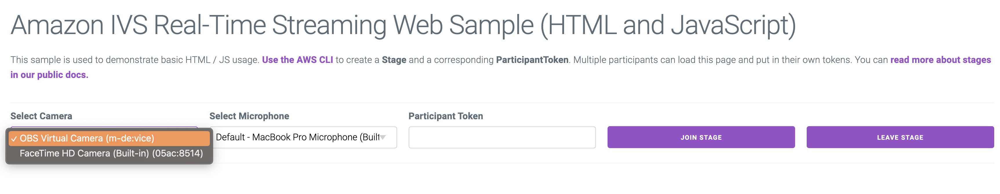

**Now that you've completed the code for stages, start your server.**

### 8. Generate tokens for participants and facilitate them joining a stage

- a. Now, navigate back to stages inside of your AWS console (Amazon IVS > Real-time streaming > stages) and click on your newly created stage from step 1.

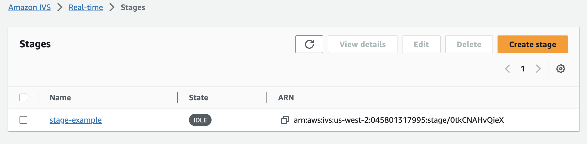

- b. To initiate and join the stage, you must generate a [participant token](https://docs.aws.amazon.com/ivs/latest/RealTimeAPIReference/API_ParticipantToken.html) for access. Click into your newly created stage and find the header "Participant tokens". Beside this header click the "Create a participant token" button:

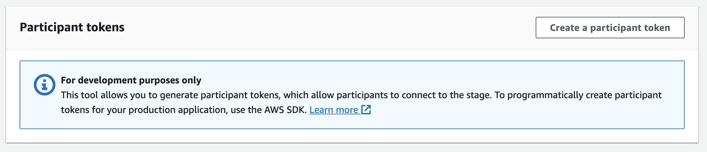

- c. Create a participant token by completing the required information.

  - Under UserId: Enter any UTF-8 encoded text up to 128 characters long.
  - Under Capabilities: Choose both publish and subscribe/
  - Under Token duration: if you want to specify a duration, you can do it here, otherwise the duration defaults to 720 min.
  - Under Attributes: To include supplementary data in your token, click 'add attribute' to provide a key-value pair. In this example, you'll see the attribute with Key: `'username'` and Value: `'stageUser'`, which will display the username `'stageUser'` over the video if available.".
    > ie. Key: username | Value: stageUser

  \*Note: In the absence of a provided `username` in the `token`, the overlay will display the participant's number within the stage as `'user-{participants}'`.

  **`client/public/js/helpers.js`**

  ```client/public/js/helpers.js

    ...

    function createOverlayEl(username) {
        const overlayEl = document.createElement("div");
        overlayEl.classList.add("overlay-pill");
        overlayEl.innerText = username ? username : `user-${participants}`;
        return overlayEl;
    }
  ```

  - Click "Create a participant token" at the bottom right hand corner of the modal.

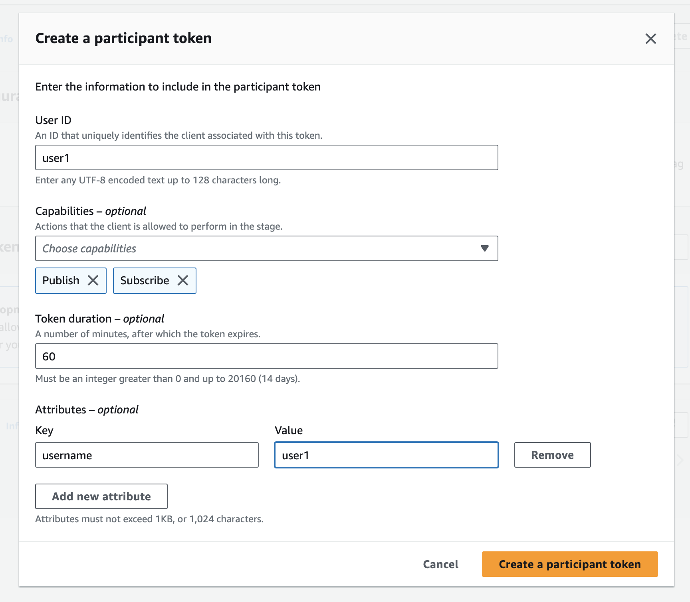

- d. Once the token is created, copy and paste it into your application (You now have access to a token that we will need to join a stage):

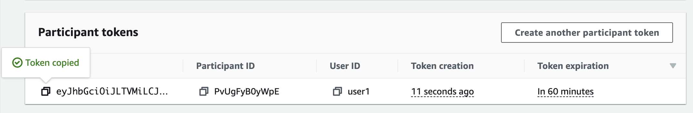

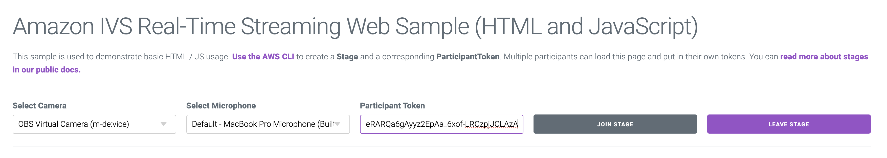

### 9. Add multiple participants to a stage

- a. Create multiple participant tokens with desired configurations.

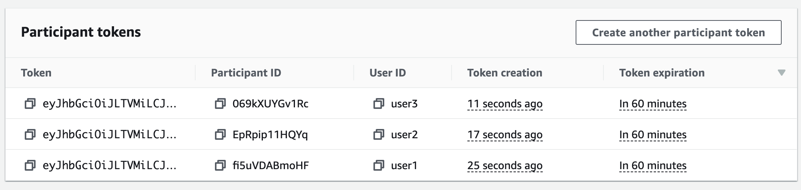

- b. Open two separate browsers, access the application, and insert different participant tokens into each.

- c. After choosing your desired camera and microphone for each browser, click "Join Stage" on each browser.

**Congratulations! You have successfully built a demo web application that enables real-time streaming among multiple participants using the Amazon IVS Web Broadcasting SDK.**

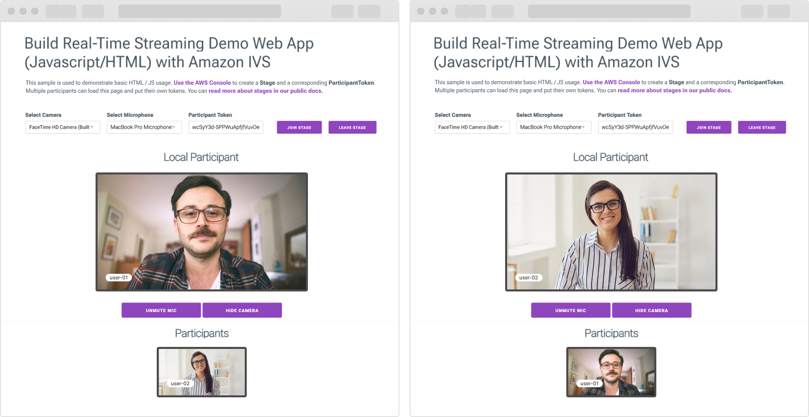

# Advanced features

## Create a dynamic grid layout for multiple participants on a stage

### Project Description

This is a demo web application intended as an educational tool for learning how to display participants in a dynamic and responsive Grid.
You will use the [CSS Grid Module](https://developer.mozilla.org/en-US/docs/Web/CSS/CSS_grid_layout) to layout the videos as it allows control over a video's horizontal and vertical position relative to other videos.

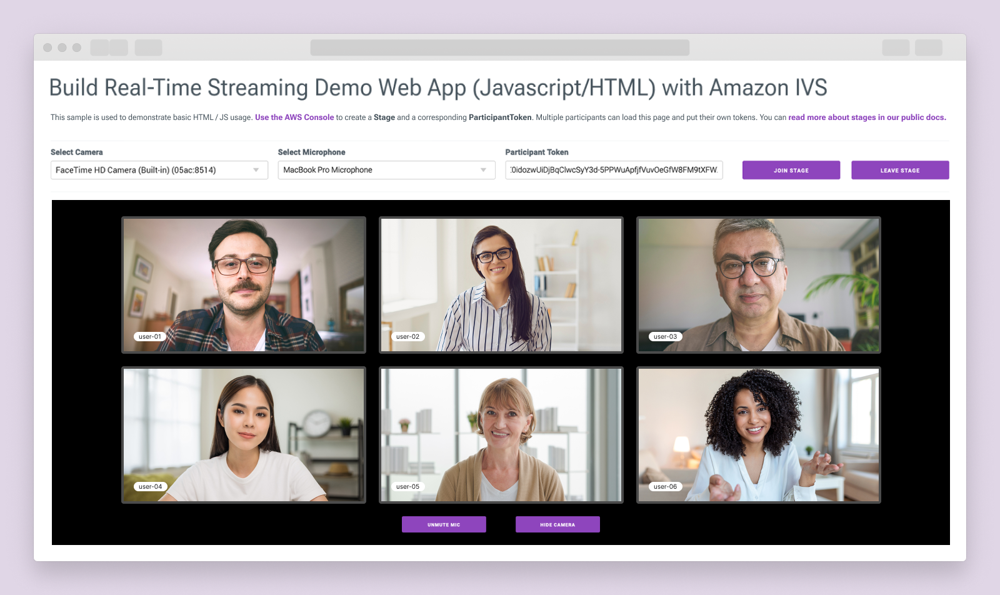

- a. Navigate from the `hello-world` folder to the `hello-world-with-grid-layout` folder by using the following commands:

  ```
  cd ..
  mkdir hello-world-with-grid-layout
  cd hello-world-with-grid-layout
  cd client
  ```

  - To install all necessary dependencies run, `yarn install`
  - To initiate the application, `yarn start`

The file structure and most of the code remain unchanged from the previous section, but you will be modifying specific sections to implement a grid layout.

```
hello-world-with-grid-layout
│
└───client
│   │   index.js
│   │   package.json
│   │   yarn.lock
│   │
│   └───public
│       │   index.html
│       └───css
│           └───index.css
│       └───js
            └───helpers.js
            └───media-devices.js
            └───stages-simple.js

```

- b. Revise `index.html` by enclosing the media divs in a grid container, ensuring any child divs have a grid display. Replace the participants section with the following code:

  **`client/public/index.html`**

  ```client/public/index.html
    <!-- Participants -->
    <div class="video-container hidden" id="video-container">
      <div class="grid" id="grid-container">
        <div id="local-media" class="media-container"></div>
        <div id="remote-media" class="media-container"></div>
      </div>
      <div class="static-controls hidden" id="local-controls">
        <div class="static-controls-button-container">
          <button class="button margin-left" id="mic-control">Mute Mic</button>
          <button class="button" id="camera-control">Hide Camera</button>
        </div>
    </div>
  ```

  **`client/public/index.html`**

  ```client/public/index.html
    <!-- Setup Controls -->
      <div class="row">
        <div class="column">
          <label for="video-devices">Select Camera</label>
          <select disabled id="video-devices">
            <option selected disabled>Choose Option</option>
          </select>
        </div>
        <div class="column">
          <label for="audio-devices">Select Microphone</label>
          <select disabled id="audio-devices">
            <option selected disabled>Choose Option</option>
          </select>
        </div>
        <div class="column">
          <label for="token">Participant Token</label>
          <input type="text" id="token" name="token" />
        </div>
        <div class="column button-container">
          <button class="button"  id="join-button">Join Stage</button>
          <button class="button"  id="leave-button">Leave Stage</button>
      </div>
    </div>
  ```

- c. Adjust `index.css` to construct a dynamic [grid layout](https://developer.mozilla.org/en-US/docs/Web/CSS/CSS_grid_layout/Basic_concepts_of_grid_layout) based on the number of participating stage members.

\*Note: Please refer to the `hello-world-with-grid-layout/public/css/index.css` for full codebase.

**`client/public/css/index.css`**

```client/public/css/index.css

/* Grid definitions */

/*! Allows the selected elements to be rendered as a grid container. */
.grid {
  display: grid;
}

/*! Assigns the specified grid area name to the elements with the class .slot-,
allowing them to be positioned within the defined grid template areas. */

.slot-1 {
  grid-area: s-1;
}

.slot-2 {
  grid-area: s-2;
}

.slot-3 {
  grid-area: s-3;
}

...

/*! This CSS code defines a dynamic grid layout with adjustable columns and rows using
the grid-template-columns and grid-template-rows properties, alongside the grid-template-areas property to designate an area identified as 's-'.
This configuration allows for flexible grid arrangements tailored for elements with the class .grid- */

.grid-1 {
  grid-template-columns: repeat(1, minmax(0, 1fr));
  grid-template-rows: repeat(1, minmax(0, 1fr));
  grid-template-areas: 's-1';
}

.grid-2 {
  grid-template-columns: repeat(2, minmax(0, 1fr));
  grid-template-rows: repeat(1, minmax(0, 1fr));
  grid-template-areas: 's-1 s-2';
}

.grid-3 {
  grid-template-columns: repeat(4, minmax(0, 1fr));
  grid-template-rows: repeat(2, minmax(0, 1fr));
  grid-template-areas:
    's-1 s-1 s-2 s-2'
    '... s-3 s-3 ...';
}

...

```

\*Note: Refer to the documentation for grid layout functionality at [MDN CSS Grid Layout](https://developer.mozilla.org/en-US/docs/Web/CSS/CSS_grid_layout) and [CSS Tricks - Complete Guide to Grid](https://css-tricks.com/snippets/css/complete-guide-grid/) for more information.

- d. In your `stages-simple.js` file, set an initial participant size and update the event listeners `StageEvents.STAGE_PARTICIPANT_JOINED`, `StageEvents.STAGE_PARTICIPANT_STREAMS_ADDED` and `StageEvents.STAGE_PARTICIPANT_LEFT` within your stage to accurately represent the current participant count and dynamically adjust the grid layout accordingly.

\*Note: Please refer to the `hello-world-with-grid-layout/public/js/stages-simple.js` for full codebase.

**`client/public/js/stages-simple.js`**

```client/public/js/stages-simple.js

// Initialize participant size
let participantSize = 0;

...

  stage.on(StageEvents.STAGE_PARTICIPANT_JOINED, (participant) => {
    console.log("Participant Joined:", participant);

    // Increments the participantSize variable by 1
    participantSize = participantSize + 1;
  });

  stage.on(
    StageEvents.STAGE_PARTICIPANT_STREAMS_ADDED,
    (participant, streams) => {
      console.log("Participant Media Added: ", participant, streams);

      // Updates the CSS class of the gridContainer element to reflect the number of participants indicated by the participantSize variable.
      gridContainer.classList = "grid " + "grid-" + participantSize;

      let streamsToDisplay = streams;

      if (participant.isLocal) {
        // Ensure to exclude local audio streams, otherwise echo will occur
        streamsToDisplay = streams.filter(
          (stream) => stream.streamType === StreamType.VIDEO
        );
      }

      const videoEl = setupParticipant(participant);
      streamsToDisplay.forEach((stream) =>
        videoEl.srcObject.addTrack(stream.mediaStreamTrack)
      );
    }
  );

  stage.on(StageEvents.STAGE_PARTICIPANT_LEFT, (participant) => {
    console.log("Participant Left: ", participant);

    // Decrements the participantSize variable by 1 and updates the CSS class of the gridContainer element to reflect the number of participants indicated by the participantSize variable.
    participantSize = participantSize - 1;
    gridContainer.classList = "grid " + "grid-" + participantSize;
    teardownParticipant(participant);
  });

  ...

```

- e. In your `helpers.js` file, initialize a `participantSize` variable and update the `setUpParticipant` and `teardownParticipant` functions to monitor the count of participants. Then in `createContainer` update the class list to reflect the number of participants.

  **`client/public/js/helpers.js`**

  ```client/public/js/helpers.js
  // Initialize participant size
  let participants = 0;

  function setupParticipant({ isLocal, id, attributes }) {

    // Increments the value of participants by 1
    participants = participants + 1;

    // It retrieves the group container element
    const groupContainer = document.getElementById("grid-container");

    // It generates a unique participant container ID based on whether the participant is local or remote and
    // creates a container element for the participant using the createContainer function.
    const participantContainerId = isLocal ? "local" : id;
    const participantContainer = createContainer(participantContainerId);

    // Create a new div element for the participant's video container and add the 'relative' class
    const participantVideoContainer = document.createElement("div");
    participantVideoContainer.classList.add("relative");

    // Creates a video element for the participant using the createVideoEl function and appends the video element to the participant's container element
    const videoEl = createVideoEl(participantContainerId);
    const overlayEl = createOverlayEl(attributes.username);

    // Appends the video element and overlay element to the participant video container,
  // then appends the participant video container to the main participant container
    participantVideoContainer.append(videoEl, overlayEl);
    participantContainer.appendChild(participantVideoContainer);

    groupContainer.appendChild(participantContainer);

    return videoEl;
  }

  function teardownParticipant({ isLocal, id }) {
    // Decrements the value of participants by 1
    participants = participants - 1;
    const groupContainer = document.getElementById("grid-container");
    const participantContainerId = isLocal ? "local" : id;

    // If the participant's container element exists, it is removed from the group container. If the element does not exist, the function exits without further action.
    const participantDiv = document.getElementById(
      participantContainerId + "-container"
    );
    if (!participantDiv) {
      return;
    }
    groupContainer.removeChild(participantDiv);

    // Gathers all elements having the class name "participant-container"
    const remainingParticipants = document.getElementsByClassName(
      "participant-container"
    );

    // Loops through each element, updating its class name with a numerical suffix, such as "slot-1," "slot-2," and so on, effectively modifying the class names of the elements.
    for (let i = 0; i < remainingParticipants.length; i++) {
      remainingParticipants[i].className =
        "participant-container " + "slot-" + (i + 1);
    }
  }

  function createVideoEl(id) {
    const videoEl = document.createElement("video");
    videoEl.id = id;
    videoEl.autoplay = true;
    videoEl.playsInline = true;
    videoEl.srcObject = new MediaStream();
    return videoEl;
  }

  function createOverlayEl(username) {
    const overlayEl = document.createElement("div");
    overlayEl.classList.add("overlay-pill");
    overlayEl.innerText = username ? username : `user-${participants}`;
    return overlayEl;
  }

  function createContainer(id) {
    const participantContainer = document.createElement("div");
    participantContainer.classList.add("participant-container");

    // Adds a class to the participantContainer element, which consists of "slot-" followed by the value of the participants variable
    participantContainer.classList.add("slot-" + participants);
    participantContainer.id = id + "-container";

    return participantContainer;
  }

  ```

- f. Generate a minimum of 3 participant tokens within the AWS console. Then, open 3 different browsers, and assign each unique token to a browser to join a stage.

\*Note: When inspecting the elements, you'll notice the layout dynamically adjusts based on the number of participants joining the stage.

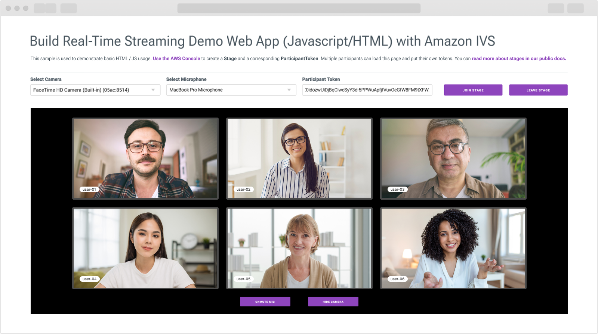

## Next steps

- Stream real-time interactions on a stage to an IVS low-latency channel to engage millions of concurrent viewers. Refer to the section "[Enabling Multiple Hosts on an Amazon IVS Stream](https://docs.aws.amazon.com/ivs/latest/LowLatencyUserGuide/multiple-hosts.html)" in the IVS Low-Latency Streaming User Guide for guidance.

- Learn more about Amazon IVS real-time streaming by visiting [Amazon IVS Real-Time Streaming User Guide](https://docs.aws.amazon.com/ivs/latest/RealTimeUserGuide/what-is.html).

- If you are interested in building for mobile platforms, explore the sample demos for [iOS](https://github.com/aws-samples/amazon-ivs-real-time-for-ios-demo/) or [Android](https://github.com/aws-samples/amazon-ivs-real-time-for-android-demo/), and the supporting [serverless applications for real-time demo](https://github.com/aws-samples/amazon-ivs-real-time-serverless-demo/).
